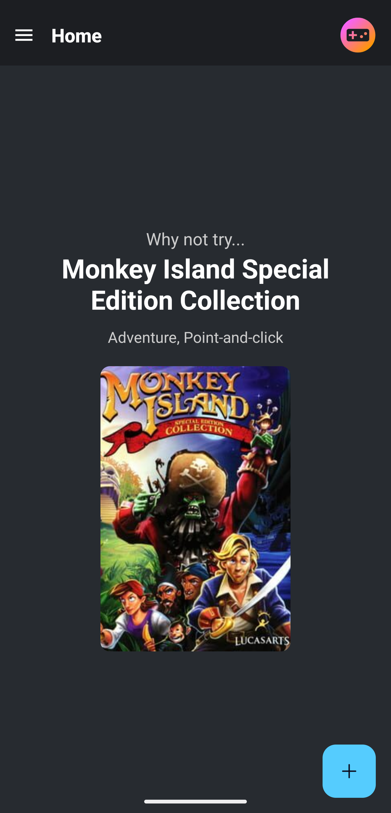
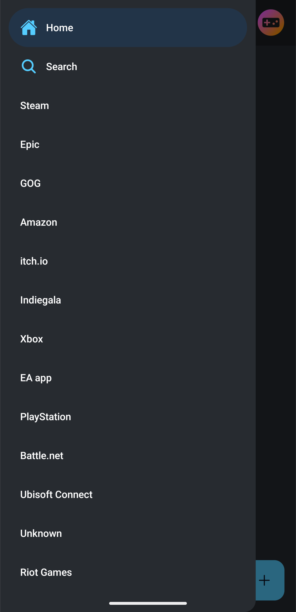
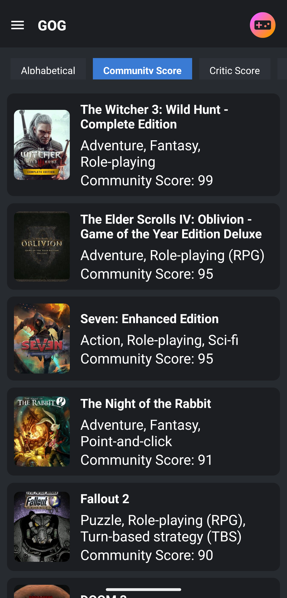

# Game Library

Is an app to store your games from multiple sources that you have on Playnite and exported through [Playnite JSON](https://github.com/zachvlat/playnite-json)


## Installation

To install the application, clone the repository and run `npm install`.

```
git clone https://github.com/zachvlat/gamelibrary.git
cd gamelibrary
npm install
```

## Usage

To run the application, run `npm start`.

```
npx expo start
```

## Screenshots

Here are some screenshots of the application:

### Homepage



### Drawer



### List



# [Guide] Exporting Your Game Library

This guide will walk you through the process of exporting your game library from Playnite into a JSON format.

## Step 1: Download the Library Exporter Extension

1. **Download the Library Exporter Extension**: 
   - Go to the following link: [playnite-json](https://github.com/zachvlat/playnite-json).
   - Install the plugin from the Releases.

## Step 2: Export Your Game Library

1. Take the generated games_export.json
2. Import the json file into your app.
